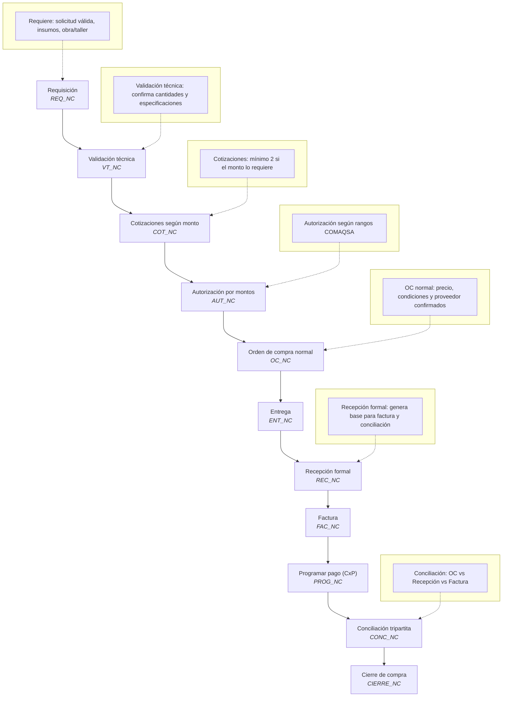

```mermaid
flowchart TD

    A["Requisici&oacute;n<br/><i>REQ_NC</i>"] --> 
    B["Validaci&oacute;n t&eacute;cnica<br/><i>VT_NC</i>"] --> 
    C["Cotizaciones seg&uacute;n monto<br/><i>COT_NC</i>"] --> 
    D["Autorizaci&oacute;n por montos<br/><i>AUT_NC</i>"] --> 
    E["Orden de compra normal<br/><i>OC_NC</i>"] --> 
    F["Entrega<br/><i>ENT_NC</i>"] --> 
    G["Recepci&oacute;n formal<br/><i>REC_NC</i>"] --> 
    H["Factura<br/><i>FAC_NC</i>"] --> 
    I["Programar pago (CxP)<br/><i>PROG_NC</i>"] --> 
    J["Conciliaci&oacute;n tripartita<br/><i>CONC_NC</i>"] --> 
    K["Cierre de compra<br/><i>CIERRE_NC</i>"]

    %% Notas laterales (subgraphs para explicaciones)
    subgraph NotaA[" "]
        NA["Requiere: solicitud válida, insumos, obra/taller"]
    end
    NA -.-> A

    subgraph NotaB[" "]
        NB["Validación técnica: confirma cantidades y especificaciones"]
    end
    NB -.-> B

    subgraph NotaC[" "]
        NC["Cotizaciones: mínimo 2 si el monto lo requiere"]
    end
    NC -.-> C

    subgraph NotaD[" "]
        ND["Autorización según rangos COMAQSA"]
    end
    ND -.-> D

    subgraph NotaE[" "]
        NE["OC normal: precio, condiciones y proveedor confirmados"]
    end
    NE -.-> E

    subgraph NotaG[" "]
        NG["Recepción formal: genera base para factura y conciliación"]
    end
    NG -.-> G

    subgraph NotaJ[" "]
        NJ["Conciliación: OC vs Recepción vs Factura"]
    end
    NJ -.-> J
```
