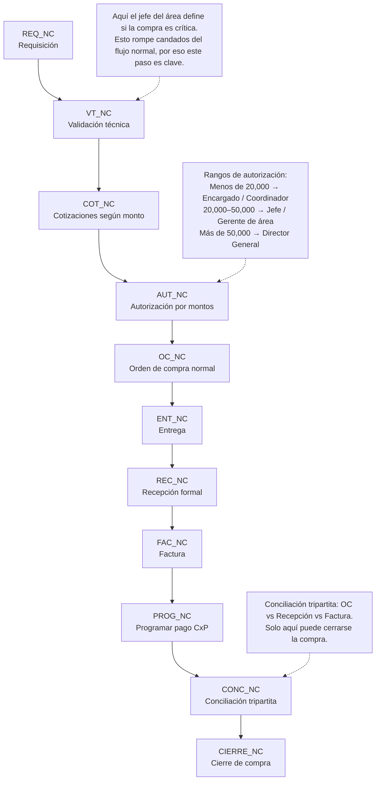

```mermaid
flowchart TD

    A["REQ_NC\nRequisición"]
    B["VT_NC\nValidación técnica"]
    C["COT_NC\nCotizaciones según monto"]
    D["AUT_NC\nAutorización por montos"]
    E["OC_NC\nOrden de compra normal"]
    F["ENT_NC\nEntrega"]
    G["REC_NC\nRecepción formal"]
    H["FAC_NC\nFactura"]
    I["PROG_NC\nProgramar pago CxP"]
    J["CONC_NC\nConciliación tripartita"]
    K["CIERRE_NC\nCierre de compra"]

    A --> B --> C --> D --> E --> F --> G --> H --> I --> J --> K

    %% NOTA: Validación técnica = punto donde se define si es CRÍTICA
    NVT["Aquí el jefe del área define si la compra es crítica.\nEsto rompe candados del flujo normal, por eso este paso es clave."] -.-> B

    %% NOTA: Rangos de autorización por montos / responsables
    NAUT["Rangos de autorización:\nMenos de 20,000 → Encargado / Coordinador\n20,000–50,000 → Jefe / Gerente de área\nMás de 50,000 → Director General"] -.-> D

    %% NOTA: Conciliación
    NCO["Conciliación tripartita: OC vs Recepción vs Factura.\nSolo aquí puede cerrarse la compra."] -.-> J
```
