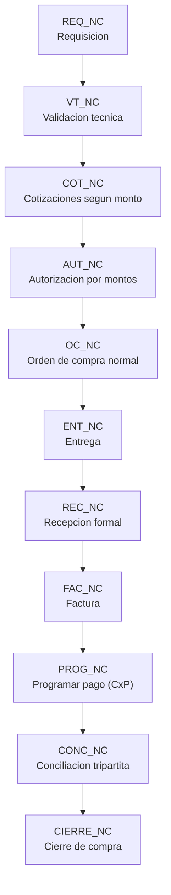

```mermaid
flowchart TD

    A["REQ_NC\nRequisicion"] --> B["VT_NC\nValidacion tecnica"]
    B --> C["COT_NC\nCotizaciones segun monto"]
    C --> D["AUT_NC\nAutorizacion por montos"]
    D --> E["OC_NC\nOrden de compra normal"]
    E --> F["ENT_NC\nEntrega"]
    F --> G["REC_NC\nRecepcion formal"]
    G --> H["FAC_NC\nFactura"]
    H --> I["PROG_NC\nProgramar pago (CxP)"]
    I --> J["CONC_NC\nConciliacion tripartita"]
    J --> K["CIERRE_NC\nCierre de compra"]
```
