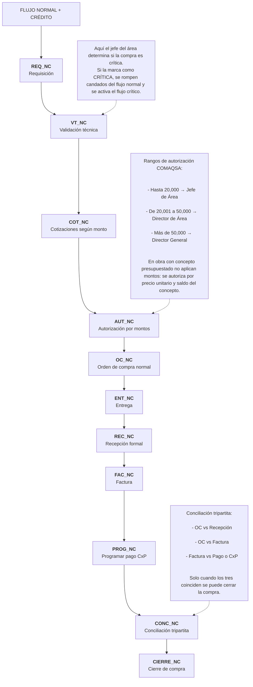

```mermaid
flowchart TD

    %% TÍTULO
    T["FLUJO NORMAL + CRÉDITO"]

    %% NODOS PRINCIPALES
    A["<b>REQ_NC</b><br/>Requisición"]
    B["<b>VT_NC</b><br/>Validación técnica"]
    C["<b>COT_NC</b><br/>Cotizaciones según monto"]
    D["<b>AUT_NC</b><br/>Autorización por montos"]
    E["<b>OC_NC</b><br/>Orden de compra normal"]
    F["<b>ENT_NC</b><br/>Entrega"]
    G["<b>REC_NC</b><br/>Recepción formal"]
    H["<b>FAC_NC</b><br/>Factura"]
    I["<b>PROG_NC</b><br/>Programar pago CxP"]
    J["<b>CONC_NC</b><br/>Conciliación tripartita"]
    K["<b>CIERRE_NC</b><br/>Cierre de compra"]

    %% FLUJO PRINCIPAL
    T --> A --> B --> C --> D --> E --> F --> G --> H --> I --> J --> K

    %% NOTA: VALIDACIÓN TÉCNICA (CRÍTICO)
    NVT["Aquí el jefe del área determina si la compra es crítica.<br/>Si la marca como CRÍTICA, se rompen candados del flujo normal y se activa el flujo crítico."] -.-> B

    %% NOTA: AUTORIZACIÓN POR MONTOS (RANGOS OFICIALES)
    NAUT["Rangos de autorización COMAQSA:<br/><br/>
    - Hasta 20,000 → Jefe de Área<br/>
    - De 20,001 a 50,000 → Director de Área<br/>
    - Más de 50,000 → Director General<br/><br/>
    En obra con concepto presupuestado no aplican montos: se autoriza por precio unitario y saldo del concepto."] -.-> D

    %% NOTA: CONCILIACIÓN
    NCO["Conciliación tripartita:<br/>
    - OC vs Recepción<br/>
    - OC vs Factura<br/>
    - Factura vs Pago o CxP<br/><br/>
    Solo cuando los tres coinciden se puede cerrar la compra."] -.-> J
```
