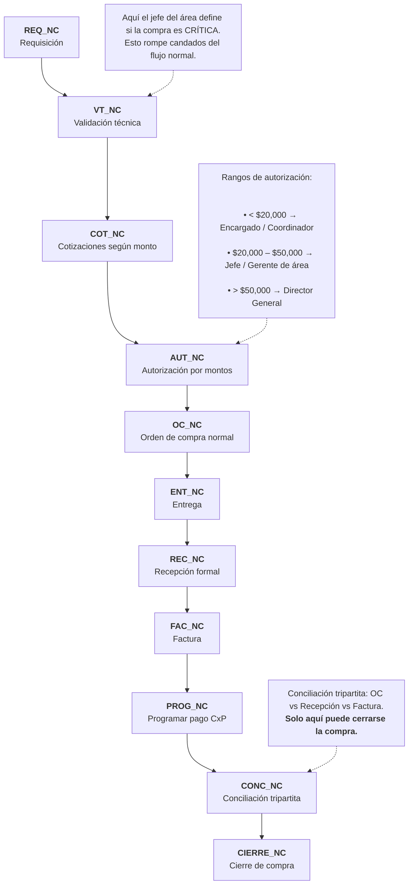

```mermaid
flowchart TD

    %% ==== NODOS PRINCIPALES CON ÍNDICE ARRIBA Y EN NEGRITAS ====

    A["<b>REQ_NC</b><br/>Requisición"]
    B["<b>VT_NC</b><br/>Validación técnica"]
    C["<b>COT_NC</b><br/>Cotizaciones según monto"]
    D["<b>AUT_NC</b><br/>Autorización por montos"]
    E["<b>OC_NC</b><br/>Orden de compra normal"]
    F["<b>ENT_NC</b><br/>Entrega"]
    G["<b>REC_NC</b><br/>Recepción formal"]
    H["<b>FAC_NC</b><br/>Factura"]
    I["<b>PROG_NC</b><br/>Programar pago CxP"]
    J["<b>CONC_NC</b><br/>Conciliación tripartita"]
    K["<b>CIERRE_NC</b><br/>Cierre de compra"]

    A --> B --> C --> D --> E --> F --> G --> H --> I --> J --> K

    %% ==== NOTAS LATERALES ====

    NVT["Aquí el jefe del área define si la compra es CRÍTICA.<br/>Esto rompe candados del flujo normal."] -.-> B

    NAUT["Rangos de autorización:<br/><br/>
    • &lt; $20,000 → Encargado / Coordinador<br/>
    • $20,000 – $50,000 → Jefe / Gerente de área<br/>
    • &gt; $50,000 → Director General"] -.-> D

    NCO["Conciliación tripartita: OC vs Recepción vs Factura.<br/><b>Solo aquí puede cerrarse la compra.</b>"] -.-> J
```
