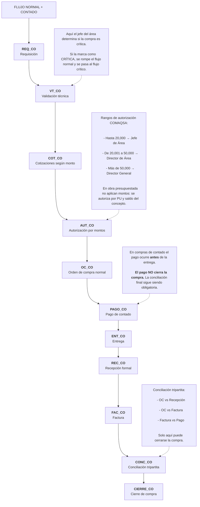

```mermaid
flowchart TD

    %% TÍTULO
    T["FLUJO NORMAL + CONTADO"]

    %% NODOS PRINCIPALES (Índice arriba en negritas)
    A["<b>REQ_CO</b><br/>Requisición"]
    B["<b>VT_CO</b><br/>Validación técnica"]
    C["<b>COT_CO</b><br/>Cotizaciones según monto"]
    D["<b>AUT_CO</b><br/>Autorización por montos"]
    E["<b>OC_CO</b><br/>Orden de compra normal"]
    F["<b>PAGO_CO</b><br/>Pago de contado"]
    G["<b>ENT_CO</b><br/>Entrega"]
    H["<b>REC_CO</b><br/>Recepción formal"]
    I["<b>FAC_CO</b><br/>Factura"]
    J["<b>CONC_CO</b><br/>Conciliación tripartita"]
    K["<b>CIERRE_CO</b><br/>Cierre de compra"]

    %% Flujo secuencial
    T --> A --> B --> C --> D --> E --> F --> G --> H --> I --> J --> K

    %% NOTA: VALIDACIÓN TÉCNICA (CRÍTICO)
    NVT["Aquí el jefe del área determina si la compra es crítica.<br/>
    Si la marca como CRÍTICA, se rompe el flujo normal y se pasa al flujo crítico."] -.-> B

    %% NOTA: AUTORIZACIÓN (Rangos oficiales)
    NAUT["Rangos de autorización COMAQSA:<br/><br/>
    - Hasta 20,000 → Jefe de Área<br/>
    - De 20,001 a 50,000 → Director de Área<br/>
    - Más de 50,000 → Director General<br/><br/>
    En obra presupuestada no aplican montos: se autoriza por PU y saldo del concepto."] -.-> D

    %% NOTA: PAGO
    NPAGO["En compras de contado el pago ocurre <b>antes</b> de la entrega.<br/>
    <b>El pago NO cierra la compra.</b> La conciliación final sigue siendo obligatoria."] -.-> F

    %% NOTA: CONCILIACIÓN
    NCO["Conciliación tripartita:<br/>
    - OC vs Recepción<br/>
    - OC vs Factura<br/>
    - Factura vs Pago<br/><br/>
    Solo aquí puede cerrarse la compra."] -.-> J
```
