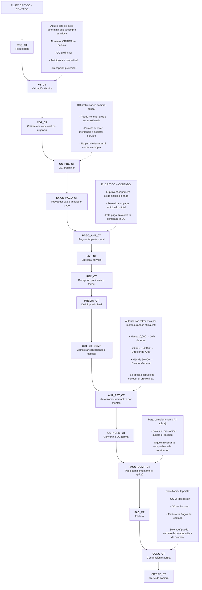

```mermaid
flowchart TD

    %% TÍTULO
    T["FLUJO CRÍTICO + CONTADO"]

    %% NODOS PRINCIPALES (IDs con _CT para distinguir CONTADO)
    A["<b>REQ_CT</b><br/>Requisición"]
    B["<b>VT_CT</b><br/>Validación técnica"]
    C["<b>COT_CT</b><br/>Cotizaciones opcional por urgencia"]
    D["<b>OC_PRE_CT</b><br/>OC preliminar"]
    E["<b>EXIGE_PAGO_CT</b><br/>Proveedor exige anticipo o pago"]
    F["<b>PAGO_ANT_CT</b><br/>Pago anticipado o total"]
    G["<b>ENT_CT</b><br/>Entrega / servicio"]
    H["<b>REC_CT</b><br/>Recepción preliminar o formal"]
    I["<b>PRECIO_CT</b><br/>Definir precio final"]
    J["<b>COT_CT_COMP</b><br/>Completar cotizaciones o justificar"]
    K["<b>AUT_RET_CT</b><br/>Autorización retroactiva por montos"]
    L["<b>OC_NORM_CT</b><br/>Convertir a OC normal"]
    M["<b>PAGO_COMP_CT</b><br/>Pago complementario (si aplica)"]
    N["<b>FAC_CT</b><br/>Factura"]
    O["<b>CONC_CT</b><br/>Conciliación tripartita"]
    P["<b>CIERRE_CT</b><br/>Cierre de compra"]

    %% FLUJO PRINCIPAL
    T --> A --> B --> C --> D --> E --> F --> G --> H --> I --> J --> K --> L --> M --> N --> O --> P

    %% =========================
    %% NOTAS LATERALES CLAVE
    %% =========================

    %% VALIDACIÓN TÉCNICA — donde se marca CRÍTICA
    NVT["Aquí el jefe del área determina que la compra es crítica.<br/>
    Al marcar CRÍTICA se habilita:<br/>
    - OC preliminar<br/>
    - Anticipos sin precio final<br/>
    - Recepción preliminar"] -.-> B

    %% OC PRELIMINAR
    NOC["OC preliminar en compra crítica:<br/>
    - Puede no tener precio o ser estimado<br/>
    - Permite separar mercancía o acelerar servicio<br/>
    - No permite facturar ni cerrar la compra"] -.-> D

    %% PAGO ANTICIPADO
    NPAGO1["En CRÍTICO + CONTADO:<br/>
    - El proveedor primero exige anticipo o pago<br/>
    - Se realiza un pago anticipado o total<br/>
    - Este pago <b>no cierra</b> la compra ni la OC"] -.-> F

    %% AUTORIZACIÓN RETROACTIVA POR MONTOS
    NAUT["Autorización retroactiva por montos (rangos oficiales):<br/><br/>
    • Hasta 20,000 → Jefe de Área<br/>
    • 20,001 – 50,000 → Director de Área<br/>
    • Más de 50,000 → Director General<br/><br/>
    Se aplica después de conocer el precio final."] -.-> K

    %% PAGO COMPLEMENTARIO
    NPAGO2["Pago complementario (si aplica):<br/>
    - Solo si el precio final supera el anticipo<br/>
    - Sigue sin cerrar la compra hasta la conciliación"] -.-> M

    %% CONCILIACIÓN
    NCO["Conciliación tripartita:<br/>
    - OC vs Recepción<br/>
    - OC vs Factura<br/>
    - Factura vs Pagos de contado<br/><br/>
    Solo aquí puede cerrarse la compra crítica de contado."] -.-> O
```
