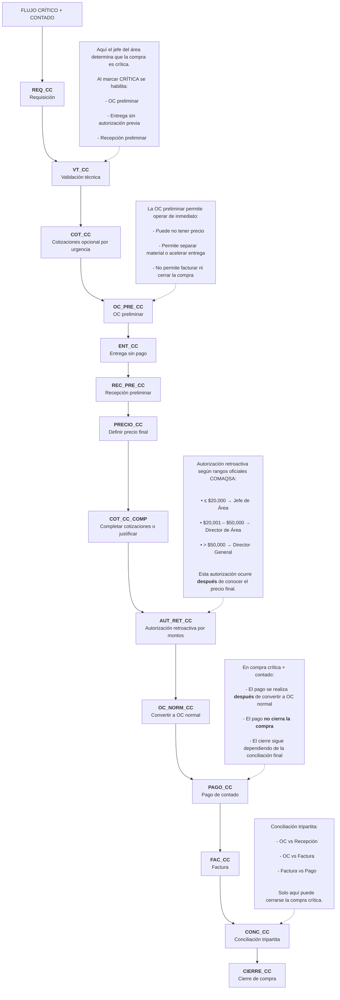

```mermaid
flowchart TD

    %% TÍTULO
    T["FLUJO CRÍTICO + CONTADO"]

    %% NODOS PRINCIPALES
    A["<b>REQ_CC</b><br/>Requisición"]
    B["<b>VT_CC</b><br/>Validación técnica"]
    C["<b>COT_CC</b><br/>Cotizaciones opcional por urgencia"]
    D["<b>OC_PRE_CC</b><br/>OC preliminar"]
    E["<b>ENT_CC</b><br/>Entrega sin pago"]
    F["<b>REC_PRE_CC</b><br/>Recepción preliminar"]
    G["<b>PRECIO_CC</b><br/>Definir precio final"]
    H["<b>COT_CC_COMP</b><br/>Completar cotizaciones o justificar"]
    I["<b>AUT_RET_CC</b><br/>Autorización retroactiva por montos"]
    J["<b>OC_NORM_CC</b><br/>Convertir a OC normal"]
    K["<b>PAGO_CC</b><br/>Pago de contado"]
    L["<b>FAC_CC</b><br/>Factura"]
    M["<b>CONC_CC</b><br/>Conciliación tripartita"]
    N["<b>CIERRE_CC</b><br/>Cierre de compra"]

    %% FLUJO PRINCIPAL
    T --> A --> B --> C --> D --> E --> F --> G --> H --> I --> J --> K --> L --> M --> N

    %% =====================================
    %% NOTAS LATERALES
    %% =====================================

    %% VALIDACIÓN TÉCNICA - donde se marca CRÍTICA
    NVT["Aquí el jefe del área determina que la compra es crítica.<br/>
    Al marcar CRÍTICA se habilita:<br/>
    - OC preliminar<br/>
    - Entrega sin autorización previa<br/>
    - Recepción preliminar"] -.-> B

    %% OC PRELIMINAR
    NOC["La OC preliminar permite operar de inmediato:<br/>
    - Puede no tener precio<br/>
    - Permite separar material o acelerar entrega<br/>
    - No permite facturar ni cerrar la compra"] -.-> D

    %% AUTORIZACIÓN RETROACTIVA POR MONTOS
    NAUT["Autorización retroactiva según rangos oficiales COMAQSA:<br/><br/>
    • ≤ $20,000 → Jefe de Área<br/>
    • $20,001 – $50,000 → Director de Área<br/>
    • > $50,000 → Director General<br/><br/>
    Esta autorización ocurre <b>después</b> de conocer el precio final."] -.-> I

    %% PAGO DE CONTADO
    NPAGO["En compra crítica + contado:<br/>
    - El pago se realiza <b>después</b> de convertir a OC normal<br/>
    - El pago <b>no cierra la compra</b><br/>
    - El cierre sigue dependiendo de la conciliación final"] -.-> K

    %% CONCILIACIÓN
    NCO["Conciliación tripartita:<br/>
    - OC vs Recepción<br/>
    - OC vs Factura<br/>
    - Factura vs Pago<br/><br/>
    Solo aquí puede cerrarse la compra crítica."] -.-> M
```
