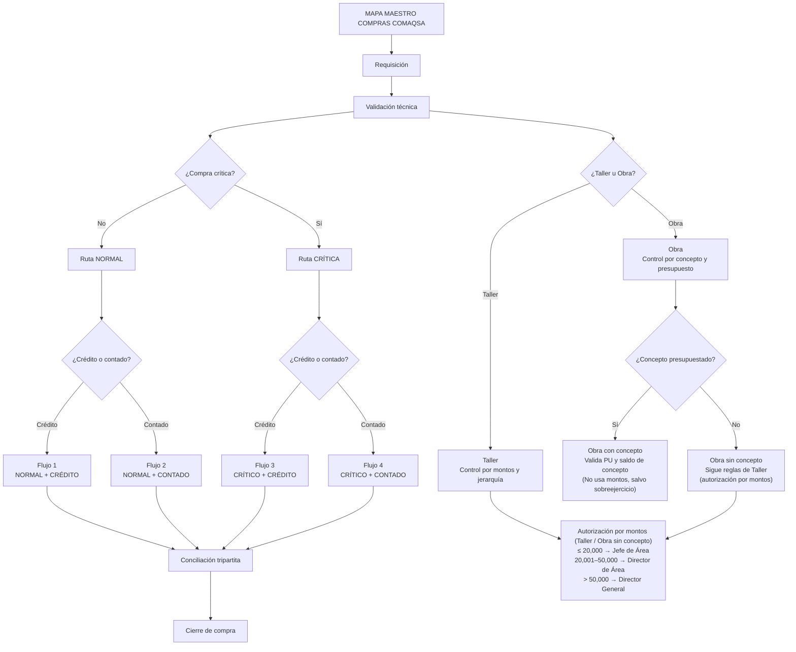

```mermaid
flowchart TD

    %% =====================================
    %% EJE PRINCIPAL: RUTAS DE FLUJO
    %% =====================================

    T["MAPA MAESTRO COMPRAS COMAQSA"]

    A[Requisición]
    B[Validación técnica]
    C{"¿Compra crítica?"}
    NORM["Ruta NORMAL"]
    CRIT["Ruta CRÍTICA"]
    D1{"¿Crédito o contado?"}
    D2{"¿Crédito o contado?"}

    F1["Flujo 1\nNORMAL + CRÉDITO"]
    F2["Flujo 2\nNORMAL + CONTADO"]
    F3["Flujo 3\nCRÍTICO + CRÉDITO"]
    F4["Flujo 4\nCRÍTICO + CONTADO"]

    CONC["Conciliación tripartita"]
    CIERRE["Cierre de compra"]

    T --> A --> B --> C
    C -->|No| NORM
    C -->|Sí| CRIT

    NORM --> D1
    CRIT --> D2

    D1 -->|Crédito| F1
    D1 -->|Contado| F2

    D2 -->|Crédito| F3
    D2 -->|Contado| F4

    F1 --> CONC
    F2 --> CONC
    F3 --> CONC
    F4 --> CONC
    CONC --> CIERRE

    %% =====================================
    %% BLOQUE LATERAL: TALLER vs OBRA
    %% (REGLAS QUE SE APLICAN A CUALQUIER FLUJO)
    %% =====================================

    B --> TO{"¿Taller u Obra?"}

    TA["Taller\nControl por montos y jerarquía"]
    OB["Obra\nControl por concepto y presupuesto"]

    TO -->|Taller| TA
    TO -->|Obra| OB

    OB_TIPO{"¿Concepto presupuestado?"}
    OB --> OB_TIPO

    OB_P["Obra con concepto\nValida PU y saldo de concepto\n(No usa montos, salvo sobreejercicio)"]
    OB_N["Obra sin concepto\nSigue reglas de Taller\n(autorización por montos)"]

    OB_TIPO -->|Sí| OB_P
    OB_TIPO -->|No| OB_N

    MONTOS["Autorización por montos (Taller / Obra sin concepto)\n≤ 20,000 → Jefe de Área\n20,001–50,000 → Director de Área\n> 50,000 → Director General"]

    TA --> MONTOS
    OB_N --> MONTOS
```
