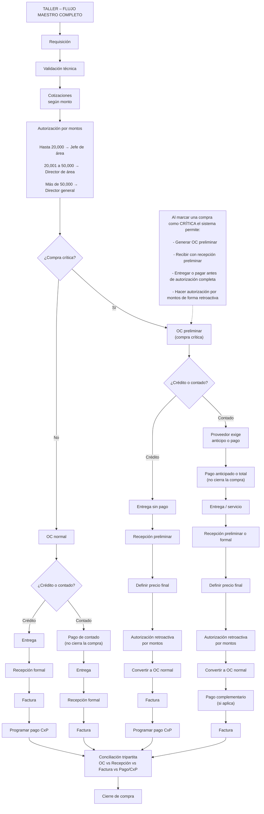

    P_C -->|Crédito| F3
    P_C -->|Contado| F4

    %% REGLAS DE AUTORIZACIÓN POR MONTOS
    REGLAS["Autorización por montos (Taller)<br/><br/>
    Hasta 20,000 → Jefe de área<br/>
    20,001 a 50,000 → Director de área<br/>
    Más de 50,000 → Director general"]
    VT --> REGLAS

    %% NOTA: QUÉ IMPLICA MARCAR COMO CRÍTICA
    NOTA_CRIT["Al marcar compra CRÍTICA se habilita:<br/>
    - OC preliminar<br/>
    - Recepción preliminar<br/>
    - Operación/pagos de urgencia según flujo<br/>
    - Autorización retroactiva por montos"] -.-> CRIT_R

    %% CIERRE COMÚN
    CONC["Conciliación tripartita"]
    CIERRE["Cierre de compra"]

    F1 --> CONC
    F2 --> CONC
    F3 --> CONC
    F4 --> CONC
    CONC --> CIERRE
```
