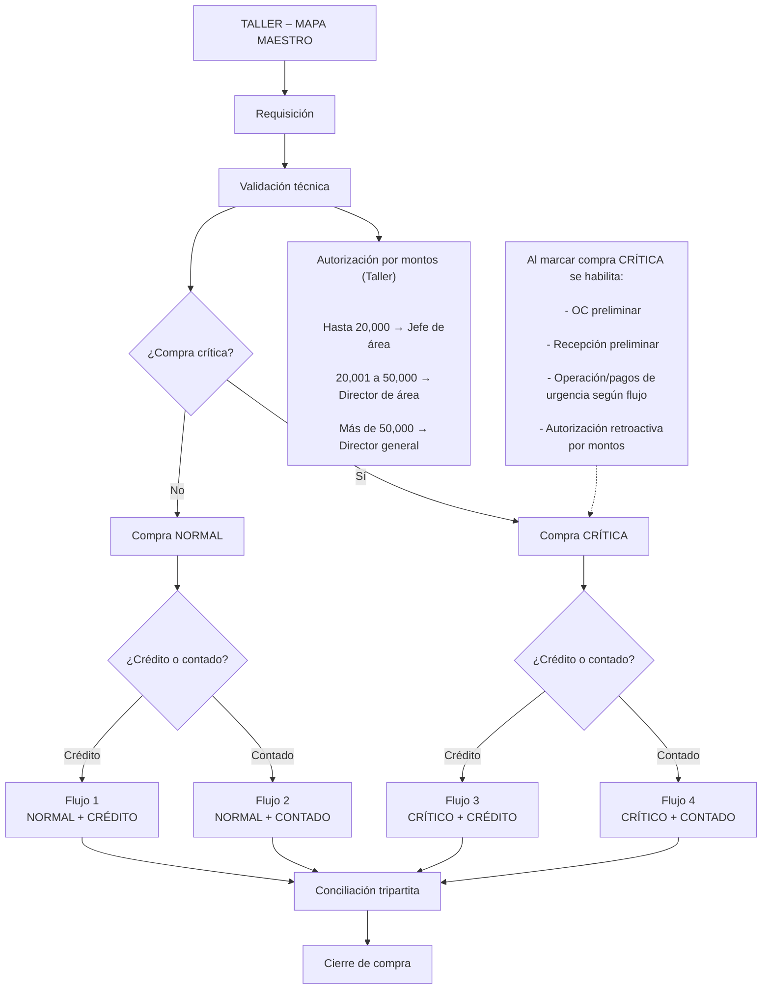

```mermaid
flowchart TD

    %% TÍTULO
    T["TALLER – MAPA MAESTRO"]

    %% INICIO
    R["Requisición"]
    VT["Validación técnica"]

    T --> R --> VT

    %% ¿COMPRA CRÍTICA?
    CRIT{"¿Compra crítica?"}
    VT --> CRIT

    NORM["Compra NORMAL"]
    CRIT_R["Compra CRÍTICA"]

    CRIT -->|No| NORM
    CRIT -->|Sí| CRIT_R

    %% FORMA DE PAGO
    P_N{"¿Crédito o contado?"}
    P_C{"¿Crédito o contado?"}

    NORM --> P_N
    CRIT_R --> P_C

    %% 4 FLUJOS MAESTROS
    F1["Flujo 1<br/>NORMAL + CRÉDITO"]
    F2["Flujo 2<br/>NORMAL + CONTADO"]
    F3["Flujo 3<br/>CRÍTICO + CRÉDITO"]
    F4["Flujo 4<br/>CRÍTICO + CONTADO"]

    P_N -->|Crédito| F1
    P_N -->|Contado| F2

    P_C -->|Crédito| F3
    P_C -->|Contado| F4

    %% REGLAS DE AUTORIZACIÓN POR MONTOS
    REGLAS["Autorización por montos (Taller)<br/><br/>
    Hasta 20,000 → Jefe de área<br/>
    20,001 a 50,000 → Director de área<br/>
    Más de 50,000 → Director general"]
    VT --> REGLAS

    %% NOTA: QUÉ IMPLICA MARCAR COMO CRÍTICA
    NOTA_CRIT["Al marcar compra CRÍTICA se habilita:<br/>
    - OC preliminar<br/>
    - Recepción preliminar<br/>
    - Operación/pagos de urgencia según flujo<br/>
    - Autorización retroactiva por montos"] -.-> CRIT_R

    %% CIERRE COMÚN
    CONC["Conciliación tripartita"]
    CIERRE["Cierre de compra"]

    F1 --> CONC
    F2 --> CONC
    F3 --> CONC
    F4 --> CONC
    CONC --> CIERRE
```
