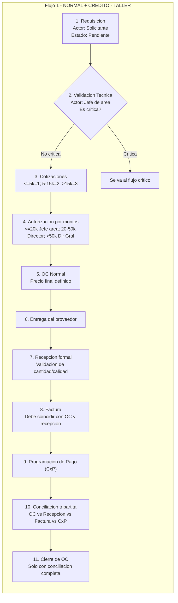

```mermaid
flowchart TD

subgraph F1["Flujo 1 - NORMAL + CREDITO - TALLER"]
direction TB

R1["1. Requisicion\nActor: Solicitante\nEstado: Pendiente"]
R2{"2. Validacion Tecnica\nActor: Jefe de area\nEs critica?"}
Rcrit["Se va al flujo critico"]

R3["3. Cotizaciones\n<=5k=1; 5-15k=2; >15k=3"]
R4["4. Autorizacion por montos\n<=20k Jefe area; 20-50k Director; >50k Dir Gral"]
R5["5. OC Normal\nPrecio final definido"]
R6["6. Entrega del proveedor"]
R7["7. Recepcion formal\nValidacion de cantidad/calidad"]
R8["8. Factura\nDebe coincidir con OC y recepcion"]
R9["9. Programacion de Pago (CxP)"]
R10["10. Conciliacion tripartita\nOC vs Recepcion vs Factura vs CxP"]
R11["11. Cierre de OC\nSolo con conciliacion completa"]

end

R1 --> R2
R2 -->|No critica| R3
R2 -->|Critica| Rcrit
R3 --> R4
R4 --> R5
R5 --> R6
R6 --> R7
R7 --> R8
R8 --> R9
R9 --> R10
R10 --> R11
```
