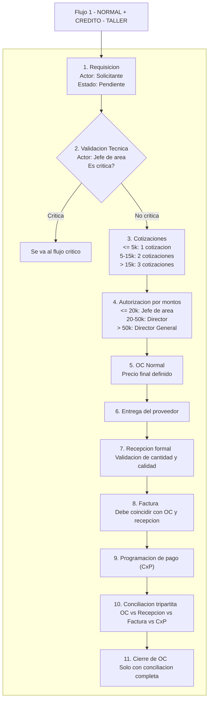

```mermaid
flowchart TD

T["Flujo 1 - NORMAL + CREDITO - TALLER"]

subgraph F1[" "]
direction TB

R1["1. Requisicion  
Actor: Solicitante  
Estado: Pendiente"]

R2{"2. Validacion Tecnica  
Actor: Jefe de area  
Es critica?"}

Rcrit["Se va al flujo critico"]

R3["3. Cotizaciones  
<= 5k: 1 cotizacion  
5-15k: 2 cotizaciones  
> 15k: 3 cotizaciones"]

R4["4. Autorizacion por montos  
<= 20k: Jefe de area  
20-50k: Director  
> 50k: Director General"]

R5["5. OC Normal  
Precio final definido"]

R6["6. Entrega del proveedor"]

R7["7. Recepcion formal  
Validacion de cantidad y calidad"]

R8["8. Factura  
Debe coincidir con OC y recepcion"]

R9["9. Programacion de pago (CxP)"]

R10["10. Conciliacion tripartita  
OC vs Recepcion vs Factura vs CxP"]

R11["11. Cierre de OC  
Solo con conciliacion completa"]

end

T --> R1
R1 --> R2
R2 -->|No critica| R3
R2 -->|Critica| Rcrit
R3 --> R4
R4 --> R5
R5 --> R6
R6 --> R7
R7 --> R8
R8 --> R9
R9 --> R10
R10 --> R11
```
