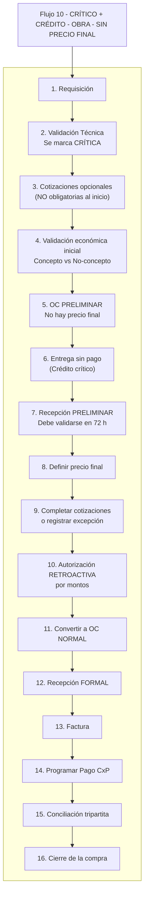

# 10 — CRÍTICO + CRÉDITO — OBRA — SIN PRECIO FINAL

Este flujo describe el proceso de compras cuando la requisición es **crítica**, pertenece a **Obra**, el método de pago es **crédito** y **NO existe precio final al inicio**.  
Por esta razón, se trata de un **flujo crítico completo**, que requiere OC preliminar, entrega anticipada, recepción preliminar, definición posterior del precio, autorización retroactiva y conciliación tripartita antes del cierre.  

Este documento sigue exactamente el estándar oficial para flujos ERP COMAQSA.

---

## 1. REQUISICIÓN

**Actor:** Usuario solicitante  
**Estado del sistema:** Pendiente  

**Inputs:** descripción, cantidades, especificaciones, concepto presupuestado (si aplica), motivo.

**Reglas / Candados:**
- La requisición es obligatoria para iniciar el proceso.

**Output:** Requisición creada.

---

## 2. VALIDACIÓN TÉCNICA (VT)

**Actor:** Jefe de área  
**Estado del sistema:** Requisición validada  

**Acciones:**
- Confirmar necesidad real.  
- Validar contra concepto presupuestado (si aplica).  
- Ajustar cantidades o especificaciones.  

**Candado crítico:**
- Aquí se **marca como CRÍTICA**.  
- El sistema registra: responsable, motivo, riesgo operativo y urgencia.  
- Esto habilita:  
  - OC preliminar  
  - Entrega sin autorización completa  
  - Recepción preliminar  
  - Autorización retroactiva  

**Output:** Requisición validada y marcada como crítica.

---

## 3. COTIZACIONES (OPCIONALES POR URGENCIA)

**Estado del sistema:** En cotización  

**Reglas:**
- En compra crítica, el sistema **NO exige** completar cotizaciones al inicio.  
- Puede haber 1 cotización o incluso ninguna.  
- Cotizaciones faltantes se completarán después o se justificarán.

**Output:** Cotizaciones cargadas o justificación de urgencia.

---

## 4. VALIDACIÓN ECONÓMICA INICIAL (OBRA)

Como **NO existe precio final**, esta validación es estimada.  
El sistema determina si la compra corresponde a un **concepto presupuestado**.

---

### 4.1 Si SÍ es concepto presupuestado

**Actor:** Sistema + área de obra  
**Estado:** Validación económica inicial  

**Validaciones:**
- PU estimado ≤ PU presupuestado  
- Saldo del concepto suficiente  

**Resultados:**
- Si PU estimado ≤ PU presupuestado y saldo suficiente → **autorización automática provisional**.  
- Si PU estimado > PU presupuestado → requiere autorización del área de obra.  
- Si saldo insuficiente → sobreejercicio (rango 20k / 50k / DG) aplicará de forma retroactiva.

---

### 4.2 Si NO es concepto presupuestado

**Actor:** Jefes / Directores según monto  
**Estado:** Validación económica estimada  

**Rangos tipo Taller (para compras no presupuestadas):**
- Hasta $20,000 → Jefe de Área  
- $20,001–$50,000 → Director de Área  
- Más de $50,000 → Director General  

**Nota:**  
En compra crítica esta autorización **no detiene** el flujo; se formalizará retroactivamente.

**Output:** Validación económica inicial completada.

---

## 5. ORDEN DE COMPRA PRELIMINAR (OC PRELIMINAR)

**Estado:** OC preliminar emitida  

**Características:**
- Obligatoria en cualquier compra crítica.  
- Sin precio final → **NO se puede emitir OC normal**.  
- Permite solicitar entrega inmediata.  
- No permite facturar.

**Output:** OC preliminar generada.

---

## 6. ENTREGA SIN PAGO (CRÉDITO)

**Estado:** En recepción  

**Acciones:**
- El proveedor entrega bienes o servicios sin pago previo.

**Candado:**  
La entrega anticipada está permitida únicamente porque el flujo es crítico.

**Output:** Entrega realizada.

---

## 7. RECEPCIÓN PRELIMINAR

**Estado:** Recepción preliminar registrada  

**Razones:**
- No existe precio final.  
- No existe OC normal.

**Reglas críticas:**
- Debe validarse en máximo **72 horas**.  
- Esta recepción **no es definitiva**.

**Output:** Recepción preliminar concluida.

---

## 8. DEFINIR PRECIO FINAL

**Estado:** En ajuste de precio  

**Acciones:**
- El proveedor confirma el precio real final.  
- Se actualiza la OC preliminar.

**Candado:**  
- Sin precio final no puede haber autorización retroactiva.

**Output:** Precio final definido.

---

## 9. COMPLETAR COTIZACIONES O JUSTIFICAR EXCEPCIÓN

**Estado:** Validación documental  

**Reglas:**
- Para autorizar retroactivamente se deben completar cotizaciones mínimas **o** justificar excepción por:  
  - Urgencia crítica  
  - OEM / único proveedor  
  - Inventario inmediato  
  - Riesgo operativo  

**Registros obligatorios:**
- Proveedor elegido  
- Motivo de excepción  
- Responsable que autorizó  

**Output:** Cotizaciones completas o excepción registrada.

---

## 10. AUTORIZACIÓN RETROACTIVA POR MONTOS (OBRA)

**Estado:** En autorización  

**Reglas:**

### Si corresponde a concepto presupuestado:
- PU final ≤ PU presupuestado y saldo suficiente → **autorización automática**.  
- PU final > PU presupuestado → autorización del área de obra.  
- Saldo insuficiente → sobreejercicio (20k / 50k / DG).  

### Si NO es concepto presupuestado:
- Hasta $20,000 → Jefe de Área  
- $20,001–$50,000 → Director de Área  
- Más de $50,000 → Director General  

**Output:** Compra autorizada retroactivamente.

---

## 11. CONVERTIR A OC NORMAL

**Estado:** OC normal emitida  

**Condiciones:**
- Precio final definido  
- Validación económica final completada  
- Sustituye a la OC preliminar

**Output:** OC normal generada.

---

## 12. RECEPCIÓN FORMAL

**Estado:** Recepción formal registrada  

**Requisitos:**
- OC normal vigente  
- Precio final validado  
- Entrega coincide  

**Output:** Recepción formal concluida.

---

## 13. FACTURA

**Estado:** En espera de conciliación  

**Reglas:**
- Debe coincidir con la OC normal y la recepción formal.  
- Diferencias detienen el flujo.

**Output:** Factura aceptada.

---

## 14. PROGRAMAR PAGO (CUENTAS POR PAGAR)

**Estado:** Documento por pagar generado  

**Acciones:**
- CxP se genera conforme a la factura validada.  
- El pago se agenda según crédito pactado.

**Output:** Pago programado.

---

## 15. CONCILIACIÓN TRIPARTITA

**Estado:** En conciliación  

**Debe coincidir:**
- **OC vs Recepción**  
- **OC vs Factura**  
- **Factura vs CxP**

**Output:** Conciliación completa.

---

## 16. CIERRE DE LA COMPRA

**Estado:** Cerrada  

**Condición:**  
Solo se cierra cuando la conciliación tripartita es correcta y completa.

**Output:** Compra cerrada sin pendientes.

---

# RESUMEN ULTRA CLARO

1. Requisición  
2. Validación técnica (se marca crítica)  
3. Cotizaciones opcionales  
4. Validación económica inicial (concepto / no concepto)  
5. OC preliminar  
6. Entrega sin pago (crédito crítico)  
7. Recepción preliminar  
8. Definir precio final  
9. Completar cotizaciones o justificar excepción  
10. Autorización retroactiva por montos  
11. Convertir a OC normal  
12. Recepción formal  
13. Factura  
14. Programar pago CxP  
15. Conciliación tripartita  
16. Cierre  

---

# DIAGRAMA

