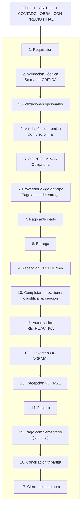

# 11 — CRÍTICO + CONTADO — OBRA — CON PRECIO FINAL

Este flujo describe el proceso de compras cuando la requisición es **crítica**, pertenece a **Obra**, el método de pago es **contado**, y **sí existe precio final desde el inicio**.  
Aunque existe precio final, por ser compra crítica el proceso **requiere OC preliminar**, pago anticipado, recepción preliminar, autorización retroactiva y conversión posterior a OC normal antes de registrar la recepción formal.  
La compra solo se cierra una vez completada la **Conciliación Tripartita**.

---

## 1. REQUISICIÓN

**Actor:** Usuario solicitante  
**Estado del sistema:** Pendiente  

**Inputs:** descripción, cantidades, especificaciones, concepto presupuestado (si aplica), motivo.

**Reglas / Candados:**
- La requisición es obligatoria para iniciar cualquier compra.

**Output:** Requisición creada.

---

## 2. VALIDACIÓN TÉCNICA (VT)

**Actor:** Jefe de área  
**Estado del sistema:** Requisición validada  

**Acciones:**
- Confirmar necesidad real.  
- Validar cantidades y especificaciones.  
- Revisar correspondencia con concepto presupuestado (si aplica).

**Candado crítico:**
- Se marca la compra como **CRÍTICA**.  
- El sistema registra: responsable, urgencia, motivo y riesgo operativo.  
- Se habilitan automáticamente:
  - OC preliminar obligatoria  
  - Pago anticipado (por ser contado)  
  - Entrega previa a autorizaciones finales  
  - Autorización retroactiva  

**Output:** Requisición validada y marcada como crítica.

---

## 3. COTIZACIONES (OPCIONALES POR URGENCIA)

**Estado del sistema:** En cotización  

**Reglas:**
- En compra crítica, las cotizaciones pueden ser mínimas o inexistentes.  
- Como **sí existe precio final**, se puede avanzar sin completar cotizaciones.  
- Las cotizaciones faltantes se completarán después, o se justificará excepción.

**Output:** Cotizaciones cargadas o justificación de urgencia.

---

## 4. VALIDACIÓN ECONÓMICA (OBRA) — CON PRECIO FINAL

Como sí existe precio final desde el inicio, la validación económica es inmediata.  
El sistema determina si la compra corresponde a un **concepto presupuestado**.

---

### 4.1 Si SÍ es concepto presupuestado

**Actor:** Sistema + área de obra  
**Estado:** Validación económica  

**Validaciones:**
- PU real ≤ PU presupuestado  
- Saldo del concepto suficiente  

**Resultados:**
- Si PU ≤ PU presupuestado y saldo suficiente → **autorización automática provisional**  
- Si PU > PU presupuestado → autorización del área de obra  
- Si saldo insuficiente → sobreejercicio (20k / 50k / DG)

---

### 4.2 Si NO es concepto presupuestado

**Actor:** Jefes / Directores según montos  
**Estado:** Evaluación económica  

**Rangos aplicables (idénticos a Taller):**
- Hasta $20,000 → Jefe de Área  
- $20,001–$50,000 → Director  
- Más de $50,000 → Director General  

**Nota:**  
Porque el flujo es crítico, esta autorización no detiene la entrega; se formaliza retroactivamente.

**Output:** Validación económica inicial completada.

---

## 5. OC PRELIMINAR (OBLIGATORIA)

**Estado:** OC preliminar emitida  

**Características:**
- Toda compra crítica requiere OC preliminar.  
- Aunque sí exista precio final, la OC normal **no puede emitirse todavía**.  
- Permite solicitar entrega y gestionar pagos anticipados.  
- No permite facturación.

**Output:** OC preliminar generada.

---

## 6. PROVEEDOR EXIGE ANTICIPO / PAGO (CONTADO)

**Estado:** Solicitud de pago  

**Reglas:**
- Como el flujo es contado, el proveedor exige **pago total o anticipo** antes de entregar.  
- El pago se basa en el precio final ya conocido.

**Output:** Exigencia de pago registrada.

---

## 7. PAGO ANTICIPADO

**Estado:** Pago aplicado  

**Acciones:**
- El pago se realiza antes de la entrega.  

**Reglas:**
- El pago **NO cierra la compra**.  
- El flujo continúa hasta la conciliación.

**Output:** Pago realizado.

---

## 8. ENTREGA

**Estado:** En recepción  

**Reglas:**
- En contado, **no hay entrega sin pago previo**.  

**Output:** Entrega realizada.

---

## 9. RECEPCIÓN PRELIMINAR

**Estado:** Recepción preliminar registrada  

**Regla absoluta:**
> **No puede existir recepción formal mientras solo exista OC preliminar.**

**Reglas adicionales:**
- Aunque sí exista precio final, la recepción debe ser preliminar.  
- Debe validarse en un máximo de **72 horas**.

**Output:** Recepción preliminar concluida.

---

## 10. COMPLETAR COTIZACIONES O JUSTIFICAR EXCEPCIÓN

**Estado:** Validación documental  

**Reglas:**
- Para avanzar a autorización retroactiva se deben completar cotizaciones o justificar excepción.  
- Excepciones válidas:
  - Único proveedor  
  - OEM  
  - Inventario inmediato  
  - Urgencia crítica  

**Registros obligatorios:**
- Proveedor elegido  
- Motivo de excepción  
- Responsable que autorizó  

**Output:** Cotizaciones completas o excepción registrada.

---

## 11. AUTORIZACIÓN RETROACTIVA (OBRA)

**Estado:** En autorización  

**Reglas:**

### Si es concepto presupuestado:
- PU ≤ PU presupuestado y saldo suficiente → autorización automática  
- PU > PU presupuestado → autorización del área de obra  
- Saldo insuficiente → sobreejercicio (20k / 50k / DG)

### Si NO es concepto presupuestado:
- Hasta $20,000 → Jefe de Área  
- $20,001–$50,000 → Director  
- Más de $50,000 → Director General  

**Output:** Compra autorizada retroactivamente.

---

## 12. CONVERTIR A OC NORMAL

**Estado:** OC normal emitida  

**Condiciones:**
- Precio final validado  
- Cotizaciones completas o justificadas  
- Autorización retroactiva aprobada  

**Output:** OC normal generada.

---

## 13. RECEPCIÓN FORMAL (CONVERSIÓN DESDE LA PRELIMINAR)

**Estado:** Recepción formal  

**Acciones:**
- La recepción preliminar se convierte ahora en **recepción formal**.  

**Reglas:**
- Requiere OC normal vigente.  
- Cantidades y especificaciones deben coincidir.

**Output:** Recepción formal concluida.

---

## 14. FACTURA

**Estado:** En conciliación  

**Reglas:**
- Debe coincidir con:
  - OC normal  
  - Recepción formal  
  - Precio final  

**Output:** Factura registrada.

---

## 15. PAGO COMPLEMENTARIO (SI APLICA)

**Estado:** Pago registrado  

**Reglas:**
- Como sí existía precio final desde el inicio, normalmente no habrá diferencia.  
- Si existiera, se genera pago complementario.

**Output:** Pago complementario aplicado.

---

## 16. CONCILIACIÓN TRIPARTITA

**Estado:** En conciliación  

Debe coincidir estrictamente:

- OC vs Recepción  
- OC vs Factura  
- Factura vs Pago  

**Candado maestro:**
> El pago NO cierra la compra; solo la conciliación completa puede hacerlo.

**Output:** Conciliación completa.

---

## 17. CIERRE DE LA COMPRA

**Estado:** Cerrada  

**Output:** Compra cerrada sin pendientes.

---

# RESUMEN ULTRA CLARO

1. Requisición  
2. Validación técnica (crítica)  
3. Cotizaciones opcionales  
4. Validación económica con precio final  
5. OC preliminar  
6. Proveedor exige anticipo  
7. Pago anticipado  
8. Entrega  
9. Recepción preliminar  
10. Completar cotizaciones o justificar excepción  
11. Autorización retroactiva  
12. Convertir a OC normal  
13. Recepción formal  
14. Factura  
15. Pago complementario (si aplica)  
16. Conciliación tripartita  
17. Cierre de la compra  

---

# DIAGRAMA

