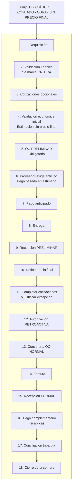

# 12 — CRÍTICO + CONTADO — OBRA — SIN PRECIO FINAL

Este flujo describe el proceso cuando la requisición es **crítica**, pertenece a **Obra**, el método de pago es **contado**, y **NO existe precio final desde el inicio**.  
Esto activa **TODO el protocolo crítico completo**: OC preliminar, pago anticipado estimado, entrega inmediata, recepción preliminar, definición posterior de precio, autorización retroactiva, conversión a OC normal y conciliación tripartita antes del cierre.  
El proceso sigue exactamente el estándar oficial COMAQSA.

---

## 1. REQUISICIÓN

**Actor:** Usuario solicitante  
**Estado:** Pendiente  

**Inputs:** descripción, cantidades, especificaciones, concepto presupuestado (si aplica), motivo.

**Reglas:**  
- Obligatoria para iniciar cualquier compra.

**Output:** Requisición creada.

---

## 2. VALIDACIÓN TÉCNICA (VT)

**Actor:** Jefe de área  
**Estado:** Requisición validada  

**Acciones:**  
- Confirmar necesidad real.  
- Validar contra concepto presupuestado.  
- Ajustar cantidades o especificaciones.

**Candado crítico:**  
- Se marca como **CRÍTICA**.  
- El sistema registra responsable, motivo, urgencia operativa y riesgo.  
- Se habilitan automáticamente:
  - OC preliminar  
  - Pago anticipado sin precio final  
  - Entrega antes de autorización  
  - Recepción preliminar  
  - Autorización retroactiva  

**Output:** Requisición validada y marcada como crítica.

---

## 3. COTIZACIONES (OPCIONALES POR URGENCIA)

**Estado:** En cotización  

**Reglas:**  
- NO es obligatorio cotizar antes.  
- Puede haber 1 cotización o ninguna.  
- Se completarán después o se justificarán.

**Output:** Cotizaciones cargadas o excepción por urgencia.

---

## 4. VALIDACIÓN ECONÓMICA INICIAL (OBRA) — SIN PRECIO FINAL

La validación es **estimada**, porque no existe precio final.

**Pregunta clave:** ¿La compra pertenece a un **concepto presupuestado**?

---

### 4.1 Si SÍ es concepto presupuestado

**Estado:** Validación económica inicial  

**Validaciones:**  
- PU estimado ≤ PU presupuestado  
- Saldo suficiente  

**Resultado:**  
- Cumple → **autorización automática provisional**  
- PU mayor → autorización de Obra (retroactiva)  
- Saldo insuficiente → sobreejercicio (20k / 50k / DG)

---

### 4.2 Si NO es concepto presupuestado

**Estado:** Validación económica estimada  

**Rangos aplicados (idénticos a Taller):**  
- Hasta $20,000 → Jefe de Área  
- $20,001–$50,000 → Director  
- Más de $50,000 → Director General  

**Nota:**  
La autorización formal ocurre **después**, de manera retroactiva, porque es compra crítica.

**Output:** Validación económica inicial completada.

---

## 5. OC PRELIMINAR

**Estado:** OC preliminar emitida  

**Características:**  
- Obligatoria en compra crítica.  
- **Sin precio final NO puede emitirse OC normal.**  
- Permite separar mercancía / solicitar servicio.  
- No permite facturar.

**Output:** OC preliminar generada.

---

## 6. PROVEEDOR EXIGE ANTICIPO (CONTADO)

**Estado:** Solicitud de pago  

**Reglas:**  
- En contado, el proveedor exige pago **antes de la entrega**.  
- Como no hay precio final, el anticipo se basa en **monto estimado**.

**Output:** Exigencia de pago registrada.

---

## 7. PAGO ANTICIPADO

**Estado:** Pago aplicado  

**Acciones:**  
- Se paga el monto estimado antes de la entrega.

**Reglas:**  
- El pago NO cierra la compra.  

**Output:** Pago anticipado registrado.

---

## 8. ENTREGA

**Estado:** En recepción  

**Reglas:**  
- En contado, no hay entrega sin pago previo.

**Output:** Entrega realizada.

---

## 9. RECEPCIÓN PRELIMINAR

**Estado:** Recepción preliminar registrada  

**Razones:**  
- No existe OC normal.  
- No existe precio final.

**Reglas:**  
- Debe validarse en máximo **72 horas**.

**Output:** Recepción preliminar concluida.

---

## 10. DEFINIR PRECIO FINAL

**Estado:** Ajuste de precio  

**Acciones:**  
- El proveedor confirma el precio final.  
- Se actualiza la OC preliminar.

**Regla crítica:**  
- Sin precio final **no puede existir autorización retroactiva**.

**Output:** Precio final definido.

---

## 11. COMPLETAR COTIZACIONES O JUSTIFICAR EXCEPCIÓN

**Estado:** Validación documental  

**Reglas:**  
- Para autorizar retroactivamente se requiere:
  - Completar cotizaciones mínimas  
  - **O** justificar excepción por:
    - Urgencia crítica  
    - OEM / único proveedor  
    - Inventario inmediato  
    - Riesgo operativo  

**Registros obligatorios:**  
- Proveedor elegido  
- Motivo  
- Responsable que autorizó  

**Output:** Cotizaciones completas o excepción registrada.

---

## 12. AUTORIZACIÓN RETROACTIVA (OBRA)

**Estado:** En autorización  

**Reglas:**  

### Si es concepto presupuestado:
- PU final ≤ PU presupuestado y saldo suficiente → automática  
- PU mayor → autorización de Obra  
- Saldo insuficiente → sobreejercicio (20k / 50k / DG)

### Si NO es concepto presupuestado:
- ≤ $20,000 → Jefe de Área  
- $20,001–$50,000 → Director  
- > $50,000 → Director General  

**Output:** Compra autorizada retroactivamente.

---

## 13. CONVERTIR A OC NORMAL

**Estado:** OC normal emitida  

**Requisitos:**  
- Precio final definido  
- Autorización retroactiva  
- Cotizaciones completas o justificadas  

**Output:** OC normal generada.

---

## 14. FACTURA

**Estado:** En conciliación  

**Reglas:**  
- Debe coincidir con:
  - OC normal  
  - Recepción preliminar (que se convertirá en formal)  

**Output:** Factura registrada.

---

## 15. RECEPCIÓN FORMAL (CONVERSIÓN)

**Estado:** Recepción formal  

**Acciones:**  
- Convertir la recepción preliminar en **formal**.

**Requisitos:**  
- OC normal vigente  
- Cantidades correctas  
- Precio final validado  

**Output:** Recepción formal concluida.

---

## 16. PAGO COMPLEMENTARIO (SI APLICA)

**Estado:** Pago registrado  

**Reglas:**  
- Si el precio final > anticipo → pago complementario  
- Si el precio final < anticipo → saldo a favor del cliente  

**Output:** Pago complementario aplicado.

---

## 17. CONCILIACIÓN TRIPARTITA

**Estado:** En conciliación  

Debe coincidir:  
- OC vs Recepción  
- OC vs Factura  
- Factura vs Pago(s)

**Regla maestra:**  
> **El pago NO cierra la compra. Solo la conciliación completa puede cerrar.**

**Output:** Conciliación concluida.

---

## 18. CIERRE DE LA COMPRA

**Estado:** Cerrada  

**Output:** Compra cerrada sin pendientes.

---

# RESUMEN ULTRA CLARO

1. Requisición  
2. Validación técnica (crítica)  
3. Cotizaciones opcionales  
4. Validación económica estimada  
5. OC preliminar  
6. Proveedor exige anticipo  
7. Pago anticipado  
8. Entrega  
9. Recepción preliminar  
10. Definir precio final  
11. Completar cotizaciones o justificar excepción  
12. Autorización retroactiva  
13. Convertir a OC normal  
14. Factura  
15. Recepción formal  
16. Pago complementario  
17. Conciliación tripartita  
18. Cierre  

---

# DIAGRAMA

