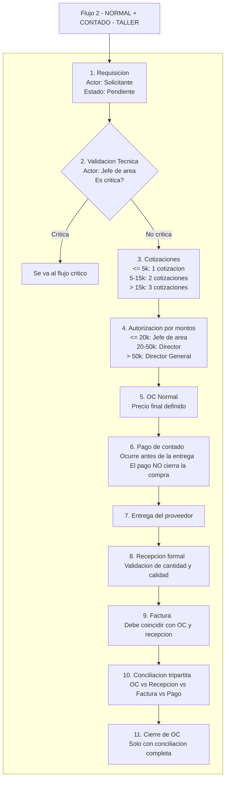

# Flujo 2 — NORMAL + CONTADO — TALLER

Este flujo describe el proceso de compras cuando la requisición **no es crítica**, pertenece al **Taller**, y el método de pago es **contado**.  
El elemento clave de este flujo es que **el pago ocurre antes de la entrega**, pero **el pago NO cierra la compra**.  
La compra solo se cierra cuando se cumple la **Conciliación Tripartita**:

- OC vs Recepción  
- OC vs Factura  
- Factura vs Pago  

A continuación se describe el proceso paso a paso:

### **1. Requisición**  
El solicitante genera una requisición. Esta inicia en estado *Pendiente*.

### **2. Validación técnica**  
El Jefe de Área revisa si la compra es crítica o no.  
Si fuera crítica, se envía al flujo correspondiente.  
Si no lo es, continúa el flujo normal.

### **3. Cotizaciones**  
Según el monto de la requisición se requiere:  
- ≤ 5k → 1 cotización  
- 5–15k → 2 cotizaciones  
- > 15k → 3 cotizaciones  

### **4. Autorización por montos**  
Dependiendo del monto total, la compra debe ser autorizada por:  
- ≤ 20k → Jefe de Área  
- 20–50k → Director  
- > 50k → Director General  

### **5. Orden de Compra (OC) Normal**  
Se genera una OC **con precio final definido**.

### **6. Pago de contado**  
El pago ocurre **antes de la entrega**.  
**Importante:** el pago **NO cierra** la compra.  

### **7. Entrega del proveedor**  
El proveedor entrega los materiales después del pago.

### **8. Recepción formal**  
Se valida cantidad y calidad contra la OC.

### **9. Factura**  
El proveedor entrega la factura.  
La factura debe coincidir con lo recibido y con la OC.

### **10. Conciliación tripartita**  
Se verifica:  
- OC vs Recepción  
- OC vs Factura  
- Factura vs Pago  

Sin esto, no puede cerrarse la compra.

### **11. Cierre de la compra**  
La OC se cierra **solo** cuando la conciliación está completa.

---

## **Diagrama del flujo**

