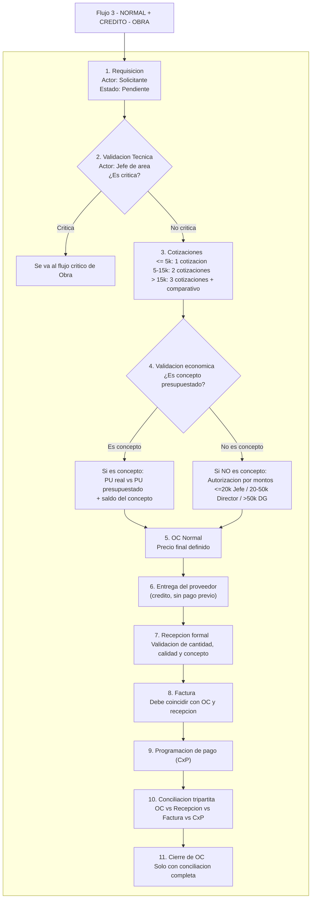

# Flujo 3 – NORMAL + CRÉDITO – OBRA

Este flujo describe el proceso de compras cuando la requisición **no es crítica**, pertenece a **Obra**, y el método de pago es **crédito**.

El elemento clave de este flujo es que **no existe pago antes de la entrega** y que la **validación económica depende de si la compra corresponde o no a un concepto presupuestado de obra**.

La compra solo se cierra cuando se cumple la **Conciliación Tripartita**:

* OC vs Recepción
* OC vs Factura
* Factura vs CxP (documento por pagar)

A continuación se describe el proceso paso a paso:

---

### **1. Requisición**

El solicitante genera una requisición. Esta inicia en estado **Pendiente**.

Debe incluir: descripción, cantidades, especificaciones, si aplica a un **concepto presupuestado de obra**, y el motivo de la compra.

---

### **2. Validación técnica (VT)**

El Jefe de Área revisa la requisición, valida la necesidad y confirma si corresponde o no a un **concepto presupuestado**.

Si aquí se marca como **crítica**, el flujo abandona este camino y pasa al flujo de **Compra Crítica – Obra**.
Si no lo es, continúa el flujo normal.

---

### **3. Cotizaciones**

Según el monto de la requisición se requiere:

* ≤ 5k → 1 cotización
* 5k–15k → 2 cotizaciones
* > 15k → 3 cotizaciones + comparativo

Las cotizaciones se capturan y, si aplica, se elabora el comparativo para seleccionar proveedor.

---

### **4. Validación económica – Obra**

Aquí se define si la compra está ligada o no a un **concepto presupuestado de obra**.

#### **4.1 Si SÍ es concepto presupuestado**

Se valida:

* Que el **PU real ≤ PU presupuestado**, y
* Que el **saldo del concepto** sea suficiente.

Resultados:

* Si PU ≤ PU presupuestado **y** saldo suficiente → **autorización automática del ERP**.
* Si PU > PU presupuestado → requiere **autorización del área de obra**.
* Si el saldo del concepto es insuficiente → requiere **autorización por sobreejercicio** (rangos 20k / 50k / Director General).

#### **4.2 Si NO es concepto presupuestado**

Se aplican los **rangos de autorización por montos tipo Taller**:

* ≤ 20k → Jefe de Área
* 20k–50k → Director de Área
* > 50k → Director General

En ambos casos, el resultado de este paso es la **autorización económica de la compra**.

---

### **5. Orden de Compra (OC) Normal**

Se genera una **OC normal con precio final definido**.

La OC normal es el documento formal y contractual que vincula lo autorizado con el proveedor.
No se puede emitir esta OC sin haber pasado por la validación económica del paso 4.

---

### **6. Entrega (crédito)**

El proveedor entrega los bienes o ejecuta el servicio **después** de emitida la OC normal.

En flujo **normal + crédito** no existe pago antes de la entrega.

---

### **7. Recepción formal**

Se registra la **recepción formal** de los bienes o servicios.

Se valida que:

* Las cantidades coincidan con la OC.
* La calidad sea aceptable.
* El concepto presupuestado (si aplica) corresponda correctamente.

---

### **8. Factura**

El proveedor emite la factura y se registra en el sistema.

La factura debe coincidir con:

* La **OC normal** (precios, impuestos, condiciones), y
* La **recepción formal** (cantidades y artículos/servicios).

Cualquier diferencia detiene el flujo hasta ser corregida o justificada.

---

### **9. Programación de pago (CxP)**

Con base en la factura validada se genera el **documento por pagar (Cuenta por Pagar)**.

La CxP se agenda según los días de crédito y las políticas de pagos de la empresa.

No se puede programar pago sin una factura válida vinculada a la OC y a la recepción.

---

### **10. Conciliación tripartita**

Se realiza la conciliación final:

* **OC vs Recepción** → artículos y cantidades coinciden.
* **OC vs Factura** → precios e impuestos correctos.
* **Factura vs CxP** → el documento por pagar cubre exactamente lo facturado.

Solo cuando estas tres comparaciones son consistentes, la compra se considera completamente conciliada.

---

### **11. Cierre de la OC**

Una vez lograda la conciliación tripartita, la OC pasa a estado **Cerrada** y el flujo termina sin pendientes.

---

