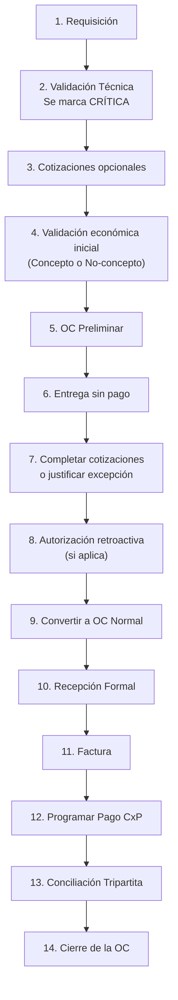

#9 FLUJO COMPLETO — CRÍTICO + CRÉDITO — OBRA — **CON PRECIO FINAL**
:contentReference[oaicite:0]{index=0}

> **Este documento sigue EXACTAMENTE el Estándar Oficial para Documentos de Flujos descrito en el README**,  
> imita el formato del **Flujo 8**, y aplica estrictamente todas las reglas definidas para:
> - Compras **Críticas**  
> - Condición **Crédito**  
> - **Obra**  
> - **Con precio final desde el inicio** (flujo crítico simplificado)

---

# EXPLICACIÓN GENERAL

Este flujo se utiliza cuando la compra **sí tiene precio final desde el inicio**, pero debe procesarse como **CRÍTICA**, porque la operación está detenida o en riesgo y se requiere avanzar **antes de completar las autorizaciones**.  

En obra, se debe determinar si la compra **corresponde o no a un concepto presupuestado**, ya que de eso depende si la validación económica es:

* **Automática** (cuando PU real ≤ PU presupuestado y el saldo del concepto es suficiente), o  
* **Retroactiva** (cuando PU > PU presupuestado, saldo insuficiente o no es concepto).

Como la compra es **crítica**, el sistema permite avanzar con:

* OC preliminar obligatoria  
* Entrega sin pago (crédito)  
* Cotizaciones incompletas al inicio  
* Autorización retroactiva (salvo que el sistema autorice automáticamente)

Y como **sí existe precio final**, NO existen pasos de “definir precio final”.

El flujo se cierra **solo** tras la **conciliación tripartita**.

---

# PASOS COMPLETOS DEL FLUJO

---

## 1. REQUISICIÓN

**Actor:** Usuario solicitante  
**Estado:** Pendiente

**Inputs:**  
- Descripción  
- Cantidades  
- Especificaciones  
- Concepto presupuestado (si aplica)  
- Motivo

**Reglas / candados:**  
- La requisición es obligatoria.  
- Se registra la información necesaria para validar contra presupuesto de obra.

**Output:** Requisición creada.

---

## 2. VALIDACIÓN TÉCNICA (VT)

**Actor:** Jefe de área  
**Estado:** Requisición validada

**Acciones:**  
- Confirmar necesidad real.  
- Validar contra concepto presupuestado (si aplica).  
- Ajustar cantidades o especificaciones.

**Candado crítico:**  
- Aquí se **marca como CRÍTICA**.  
- El sistema registra: responsable, motivo, riesgo operativo, urgencia.  
- Al marcar crítica se habilita:  
  * OC preliminar  
  * Entrega sin autorización completa  
  * Cotizaciones incompletas  
  * Autorización retroactiva por montos (si aplica)

**Output:** Requisición validada y marcada como crítica.

---

## 3. COTIZACIONES (OPCIONALES POR URGENCIA)

**Estado:** En cotización

**Reglas:**  
- En compra crítica, el sistema **NO exige completar cotizaciones al inicio**.  
- Puede haber **1 cotización**, o incluso **ninguna**.  
- Como sí existe precio final, la cotización disponible puede ser la definitiva.  
- Las cotizaciones faltantes se completan después o se justifican por excepción.

**Output:** Cotización(es) cargadas o justificación de urgencia.

---

## 4. VALIDACIÓN ECONÓMICA INICIAL (OBRA) — CON PRECIO FINAL

**Estado:** Validación económica

Como **sí existe precio final**, la validación económica es **inmediata**.  
En compra crítica, **no detiene el flujo**; si no queda autorizada automáticamente, se formaliza más adelante como **autorización retroactiva**.

**DECISIÓN:** ¿La compra corresponde a un **concepto presupuestado**?

---

### 4.1 Si **SÍ** es concepto presupuestado

**Actor:** Sistema + Área de obra

**Validaciones:**  
- PU real ≤ PU presupuestado.  
- Saldo del concepto suficiente.

**Resultados posibles:**  
- Si PU ≤ PU presupuestado **y** saldo suficiente → **Autorización automática del ERP** (NO se requerirá autorización retroactiva).  
- Si PU > PU presupuestado → autorización del área de obra (se formalizará retroactivamente más adelante).  
- Si saldo insuficiente → sobreejercicio (rangos 20k / 50k / DG), también formalizado retroactivamente.

---

### 4.2 Si **NO** es concepto presupuestado

**Actor:** Jefes / Directores según monto (mismos rangos que Taller)

**Rangos:**  
- Hasta $20,000 → Jefe de Área  
- $20,001–$50,000 → Director de Área  
- Más de $50,000 → Director General

**Notas:**  
- Esta validación **no detiene** el flujo crítico.  
- Si el flujo avanzó por urgencia, la autorización se formaliza **retroactivamente**.

**Output:** Compra evaluada económicamente (autorizada automática o pendiente de autorización retroactiva).

---

## 5. ORDEN DE COMPRA PRELIMINAR (OC PRELIMINAR)

**Estado:** OC preliminar emitida

**Características:**  
- Obligatoria en compra crítica, incluso cuando **sí existe precio final**.  
- Permite separar mercancía o acelerar servicio.  
- **No permite facturar.**  
- Debe convertirse en OC normal posteriormente.

**Output:** OC preliminar generada.

---

## 6. ENTREGA SIN PAGO (CRÉDITO)

**Estado:** En recepción

**Acciones:**  
- Proveedor entrega bienes/servicio **sin pago previo** (porque es crédito).

**Candado:**  
- Entrega anticipada permitida solo porque la compra es crítica.

**Output:** Entrega registrada.

---

## 7. COMPLETAR COTIZACIONES O JUSTIFICAR EXCEPCIÓN

**Estado:** Validación documental

**Reglas:**  
- Si faltan cotizaciones, deben completarse.  
- Si no fue posible por urgencia → justificar excepción:  
  * OEM  
  * Único proveedor disponible  
  * Inventario inmediato  
  * Urgencia operativa  
- Registrar: proveedor elegido, motivo de excepción, responsable que autorizó.

**Output:** Cotizaciones completas o excepción registrada.

---

## 8. AUTORIZACIÓN RETROACTIVA POR MONTOS (solo si no hubo autorización automática)

**Estado:** En autorización

**Reglas:**  
- Aplica porque la compra es crítica.  
- Como **sí existe precio final**, la autorización retroactiva es directa.

**Rangos:**  
- Hasta $20,000 → Jefe de Área  
- $20,001–$50,000 → Director de Área  
- Más de $50,000 → Director General

**Nota:**  
Si el sistema autorizó automáticamente en el paso 4 (caso de concepto con PU y saldo suficiente), **este paso NO es necesario**.

**Output:** Compra autorizada retroactivamente.

---

## 9. CONVERTIR A OC NORMAL

**Estado:** OC normal emitida

**Condiciones para convertir:**  
- Precio final ya registrado desde el inicio.  
- Cotizaciones completas o justificadas.  
- Autorización retroactiva aprobada (si aplicaba).  

**Acciones:**  
- La OC preliminar se transforma en **OC normal**.  
- La OC normal ahora es la base para facturar y para conciliación formal.

**Output:** OC normal generada.

---

## 10. RECEPCIÓN FORMAL

**Estado:** Recepción formal registrada

**Acciones:**  
- Se convierte la entrega registrada (ligada a OC preliminar) en **recepción formal** una vez que existe OC normal.  
- Validaciones: cantidad, calidad, concepto (si aplica), correspondencia con OC normal.

**Output:** Recepción formal concluida.

---

## 11. FACTURA

**Estado:** En espera de conciliación

**Reglas:**  
- Debe coincidir con la OC normal y la recepción formal.  
- Si es concepto presupuestado, el PU debe seguir siendo válido.  
- Cualquier diferencia detiene el flujo hasta corregir.

**Output:** Factura aceptada.

---

## 12. PROGRAMAR PAGO (CUENTAS POR PAGAR)

**Estado:** Documento por pagar generado

**Reglas:**  
- Como es **crédito**, se crea un documento por pagar (CxP).  
- Se programa según días de crédito pactados.  
- No puede programarse sin factura válida.

**Output:** CxP creado y programado.

---

## 13. CONCILIACIÓN TRIPARTITA

**Estado:** En conciliación

Debe coincidir estrictamente:

1. **OC vs Recepción**  
2. **OC vs Factura**  
3. **Factura vs CxP** (crédito)

**Candado maestro:**  
> Ninguna compra cierra por pago ni por emisión de OC.  
> **Solo cierra por conciliación completa.**

**Output:** Conciliación concluida.

---

## 14. CIERRE DE LA OC

**Estado:** Cerrada

Condiciones:  
- No hay diferencias  
- No hay pendientes  
- Conciliación tripartita completada

**Output:** OC cerrada.

---

# RESUMEN ULTRA CLARO

**Es crítico + crédito + obra + con precio final → flujo crítico simplificado.**

1. Requisición  
2. VT → se marca crítica  
3. Cotizaciones opcionales  
4. Validación económica inmediata (PU + saldo si es concepto; rangos si no)  
5. OC preliminar  
6. Entrega sin pago  
7. Completar cotizaciones o justificar  
8. Autorización retroactiva (si no hubo autorización automática del sistema)  
9. Convertir a OC normal  
10. Recepción formal  
11. Factura  
12. Programación de pago (CxP)  
13. Conciliación tripartita  
14. Cierre

**Regla central:**  
Aunque exista precio final, la compra crítica **siempre inicia con OC preliminar**.

---

# DIAGRAMA MERMAID

