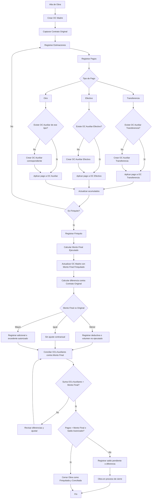

# ERP Obras - Control de Contratos y Estimaciones

## Objetivo

Permitir el control de obras subcontratadas mediante contratos,
estimaciones, pagos y finiquitos.

---

## Entidades

### Obra

### OC Madre

### OC Auxiliar

### Estimación

### Pago

---

## Reglas de Negocio

RN-001

Al crear una obra se genera automáticamente una OC Madre asociada a dicha obra.

RN-002

La OC Madre conserva permanentemente el monto original contratado y este valor nunca debe sobrescribirse.

RN-003

Una obra puede contener múltiples estimaciones.

RN-004

Cada estimación puede registrar uno o varios pagos.

RN-005

Cada pago debe tener asociado un tipo de pago.

RN-006

Los tipos de pago permitidos serán configurables por el sistema.

RN-007

Cuando se registra el primer pago de un tipo determinado, el sistema generará automáticamente una OC Auxiliar para dicho tipo de pago.

RN-008

Una OC Auxiliar únicamente podrá contener pagos correspondientes a su tipo de pago.

RN-009

Las OCs Auxiliares son mecanismos de conciliación y no representan contratos independientes.

RN-010

La OC Madre debe mostrar siempre la información consolidada de la obra.

RN-011

Las estimaciones pueden distribuirse entre múltiples tipos de pago.

RN-012

Los pagos pueden aplicarse parcial o totalmente a una estimación.

RN-013

La obra puede permanecer abierta aun cuando todas las estimaciones registradas se encuentren pagadas.

RN-014

El último pago realizado no implica automáticamente el cierre de la obra.

RN-015

El cierre contractual únicamente podrá realizarse mediante el registro de un Finiquito.

RN-016

El Finiquito determina el monto final ejecutado de la obra.

RN-017

El monto final ejecutado puede ser menor, igual o mayor al monto original contratado.

RN-018

Al registrarse el Finiquito, la OC Madre debe almacenar el Monto Final Finiquitado.

RN-019

La diferencia entre el monto original contratado y el monto final finiquitado deberá conservarse para fines históricos y de análisis.

RN-020

La suma de todas las OCs Auxiliares debe coincidir con el monto final finiquitado.

RN-021

La obra no podrá marcarse como cerrada mientras existan diferencias de conciliación.

RN-022

Las diferencias entre el monto original y el monto final deberán clasificarse como:

Volumen no ejecutado.
Deductiva.
Adicional autorizado.
Ajuste de cierre.
RN-023

Toda modificación de estimaciones, pagos o finiquitos deberá conservar trazabilidad histórica.

RN-024

El sistema deberá permitir consultar en cualquier momento:

Contrato original.
Estimado acumulado.
Pagado acumulado.
Monto final finiquitado.
Diferencia contractual.
Desglose por tipo de pago.
RN-025

Una obra únicamente podrá cambiar al estado Cerrada cuando exista un finiquito registrado y todas las conciliaciones se encuentren cuadradas.

---

## Estados

Alta
En ejecución
Con estimaciones
Con pagos
En proceso de finiquito
Finiquitada
Cerrada

---

## Flujo Operativo

---

## Casos Especiales

CE-001 Finiquito menor al contrato original

El monto final ejecutado es inferior al monto contratado originalmente.

CE-002 Finiquito mayor al contrato original

El monto final ejecutado supera el monto contratado originalmente.

CE-003 Pagos mixtos

Una misma estimación se paga mediante múltiples tipos de pago.

CE-004 Ajustes posteriores al finiquito

El sistema debe permitir reabrir conciliación bajo autorización.

CE-005 Cancelación de estimaciones

La cancelación debe conservar trazabilidad histórica y recalcular saldos.

CE-006 Cambio de clasificación de pago

Un pago podrá reclasificarse entre OCs Auxiliares conservando bitácora de auditoría.
