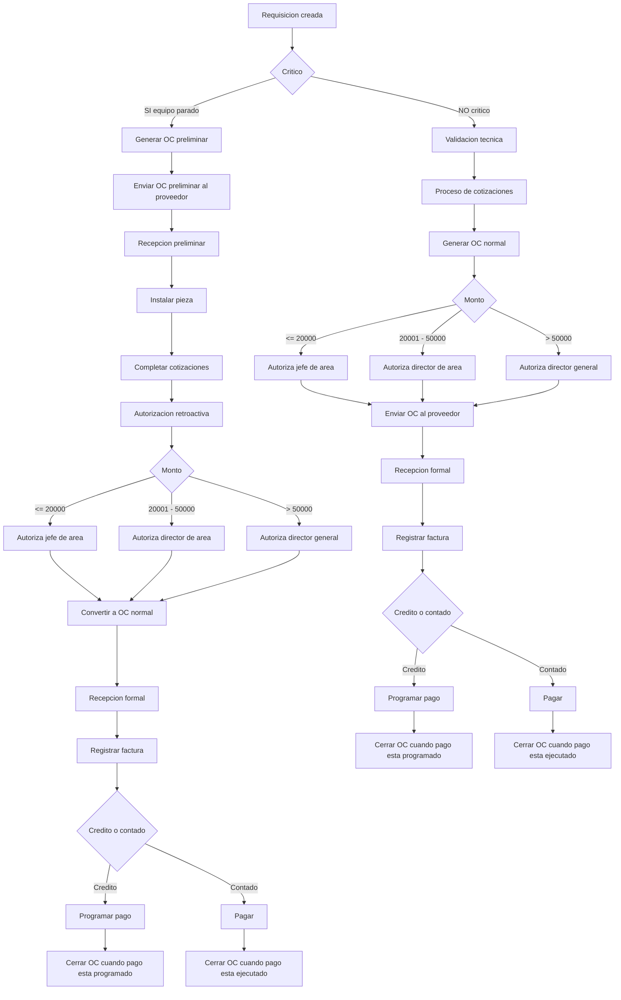

# Flujo de Compras COMAQSA – BPMN (Mermaid) – V3 (GitHub compatible)

Reglas clave integradas en este diagrama:

- En compras a **credito**, la OC se **cierra cuando el pago esta programado**.
- En compras **de contado**, la OC se **cierra cuando el pago ya se ejecuto**.

---

---

## Notas

