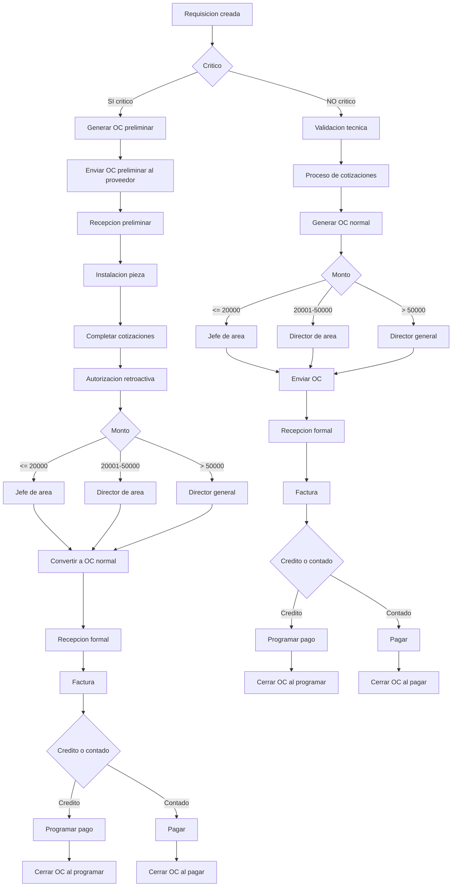

# Flujo Compras COMAQSA – Documentacion Completa V3 (GitHub compatible)

# Explicacion V1 – Variaciones del flujo por tipo de orden

Esta seccion describe como cambia el flujo general de compras dependiendo del tipo de orden: normal o critica, y dependiendo de la forma de pago: credito o contado. Las variaciones estan integradas en el mismo flujo maestro del ERP. No existen flujos paralelos, sino reglas condicionales que activan o desactivan pasos.

---

## 1. Orden Normal + Credito

1. Requisicion  
2. Validacion tecnica  
3. Cotizaciones segun monto  
4. Autorizacion segun escalonamiento  
5. OC normal  
6. Envio al proveedor  
7. Recepcion formal  
8. Factura  
9. Programar pago  
10. Cierre de OC al programar pago  

---

## 2. Orden Normal + Contado

1. Requisicion  
2. Validacion tecnica  
3. Cotizaciones  
4. Autorizacion  
5. OC normal  
6. Bloqueo: no se puede enviar OC hasta pagar  
7. Pago ejecutado  
8. Envio al proveedor  
9. Recepcion formal  
10. Factura  
11. Cierre de OC al ejecutar el pago  

---

## 3. Orden Critica + Credito (OC preliminar)

1. Requisicion marcada CRITICO  
2. OC preliminar  
3. Envio para separar  
4. Recepcion preliminar  
5. Instalacion pieza  
6. Cotizaciones si faltan  
7. Autorizacion retroactiva  
8. Convertir a OC normal  
9. Recepcion formal  
10. Factura  
11. Programar pago  
12. Cierre de OC al programar pago  

---

## 4. Orden Critica + Contado (el caso clave)

1. Requisicion marcada CRITICO  
2. OC preliminar  
3. Proveedor exige pago antes de entregar  
4. Pago anticipado o total  
5. Envio al proveedor  
6. Recepcion preliminar o formal  
7. Precio final confirmado  
8. Autorizacion retroactiva si aplica  
9. Factura  
10. Cierre de OC al ejecutar el pago  

---

## 5. Reglas tecnicas para desarrollo

### CRITICO:
- Permite OC preliminar sin autorizacion  
- Permite recepcion preliminar  
- Requiere autorizacion retroactiva  
- Requiere justificacion  

### Cierre de OC:
```
IF credito:
    cerrar OC = pago programado
ELSE:
    cerrar OC = pago ejecutado
```

### OC preliminar:
- Permite separar  
- No permite facturar  
- Permite recepcion preliminar  

---

# Explicacion Completa V2 – Paso a paso del diagrama

Esta explicacion detalla todo lo que sucede en cada nodo del diagrama BPMN.

---

## A – Requisicion creada
Generada por taller, almacen o area solicitante. Solo define la necesidad.

---

## B – Decision: Critico
Evalua si la requisicion es critica. Si si, pasa al flujo preliminar. Si no, pasa al flujo normal.

---

# Rama critica

## C – Generar OC preliminar
OC preliminar sin autorizacion ni cotizaciones completas.

## D – Enviar OC preliminar
Sirve para separar material o programar servicio.

## E – Recepcion preliminar
Registro no formal de que el material llego.

## F – Instalacion pieza
Pieza instalada o servicio ejecutado.

## G – Completar cotizaciones
Compras formaliza el precio real.

## H – Autorizacion retroactiva
Segun monto: jefe, director o director general.

## I / J / K / L – Escalonamiento
I determina ruta segun monto.  
J = jefe.  
K = director.  
L = director general.

## M – Convertir a OC normal
La OC queda como autorizada formalmente.

## N – Recepcion formal
Entrada a inventario y costo definitivo.

## O – Factura
CxP registra factura.

## P – Decision: Credito o contado

## Q – Programar pago (credito)
CxP agenda pago.

## S – Cerrar OC al programar
OC cerrada en credito.

## R – Pagar (contado)
Pago ejecutado.

## T – Cerrar OC al pagar
OC cerrada en contado.

---

# Rama normal

## U – Validacion tecnica
Jefe de area revisa la requisicion.

## V – Proceso de cotizaciones
Se obtienen las cotizaciones segun reglas.

## W – Generar OC normal
Pendiente de autorizacion.

## X / Y / Z / AA – Autorizacion
Autorizacion segun monto.

## AB – Enviar OC
OC autorizada enviada al proveedor.

## AC – Recepcion formal
Entradas a inventario.

## AD – Factura
CxP registra factura.

## AE – Decision: Credito o contado

## AF – Programar pago (credito)
Cierre al programar.

## AH – Cerrar OC al programar

## AG – Pagar (contado)

## AI – Cerrar OC al pagar

---

# BPMN – Flujo Maestro (Mermaid)



---

# Fin del documento
Archivo completamente compatible con GitHub, ASCII puro.
