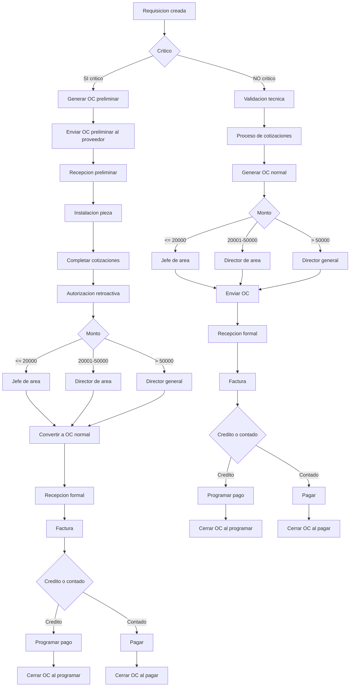

# Flujo Compras COMAQSA – Documentacion Completa V4 (GitHub compatible)

# Explicacion General – Funcionamiento del Modulo de Compras en el ERP

El modulo de compras en COMAQSA opera bajo un principio central:

"Todo debe fluir, pero nada puede fluir sin control."

Para lograrlo, el ERP estructura el proceso en tres controles:

1. Control tecnico (validacion de jefe de area)
2. Control comercial (cotizaciones y seleccion del proveedor)
3. Control financiero (autorizacion por monto y cierre segun forma de pago)

Toda compra inicia con una requisicion, lo cual garantiza trazabilidad y auditoria.

---

# Reglas de Cotizaciones

Las reglas aplican en todas las areas y en todo lo que no sea OC preliminar critica.  
En compras criticas, se aplican despues de atender la urgencia.

- Hasta 5000 MXN → 1 cotizacion  
- 5001 a 30000 MXN → 2 cotizaciones  
- Mayor a 30000 MXN → 3 cotizaciones + comparativo obligatorio  

El ERP evita avanzar a OC normal si no se cumple con estas cotizaciones.

---

# Explicacion V1 – Variaciones del Flujo por Tipo de Orden

## 1. Orden Normal + Credito
1. Requisicion  
2. Validacion tecnica  
3. Cotizaciones  
4. Autorizacion  
5. OC normal  
6. Envio al proveedor  
7. Recepcion formal  
8. Factura  
9. Programar pago  
10. Cierre al programar pago  

## 2. Orden Normal + Contado
1. Requisicion  
2. Validacion tecnica  
3. Cotizaciones  
4. Autorizacion  
5. OC normal  
6. No se puede enviar OC hasta pagar  
7. Pago ejecutado  
8. Envio  
9. Recepcion formal  
10. Factura  
11. Cierre al pagar  

## 3. Orden Critica + Credito
1. Requisicion marcada critico  
2. OC preliminar  
3. Envio al proveedor  
4. Recepcion preliminar  
5. Instalacion  
6. Completar cotizaciones  
7. Autorizacion retroactiva  
8. Convertir a OC normal  
9. Recepcion formal  
10. Factura  
11. Programar pago  
12. Cierre al programar pago  

## 4. Orden Critica + Contado
1. Requisicion marcada critico  
2. OC preliminar  
3. Proveedor exige pago antes de entregar  
4. Pago anticipado o total  
5. Envio  
6. Recepcion preliminar o formal  
7. Confirmar precio final  
8. Autorizacion retroactiva  
9. Factura  
10. Cierre al pagar  

---

# Reglas Tecnicas

### CRITICO:
- Permite OC preliminar sin autorizacion  
- Permite recepcion preliminar  
- Requiere autorizacion retroactiva  
- Requiere justificacion  

### Cierre de OC:
IF credito → cerrar al programar  
IF contado → cerrar al pagar  

### OC Preliminar:
- No se puede facturar  
- No puede cerrar  
- Permite recepcion preliminar  

---

# Explicacion V2 – Paso a Paso del BPMN

## A – Requisicion creada
Inicia proceso, solo define necesidad.

## B – Critico
Determina si fluye por camino preliminar o normal.

# Rama critica
C → OC preliminar  
D → Envio preliminar  
E → Recepcion preliminar  
F → Instalacion  
G → Completar cotizaciones  
H → Autorizacion retroactiva  
I/J/K/L → Autorizador segun monto  
M → Convertir a OC normal  
N → Recepcion formal  
O → Factura  
P → Credito o contado  
Q → Programar pago  
S → Cerrar al programar  
R → Pagar  
T → Cerrar al pagar  

# Rama normal
U → Validacion tecnica  
V → Cotizaciones  
W → OC normal  
X/Y/Z/AA → Autorizacion  
AB → Envio  
AC → Recepcion formal  
AD → Factura  
AE → Credito o contado  
AF → Programar pago  
AH → Cerrar al programar  
AG → Pagar  
AI → Cerrar al pagar  

---

# BPMN – Flujo Maestro (Mermaid)

---

# Fin del documento
