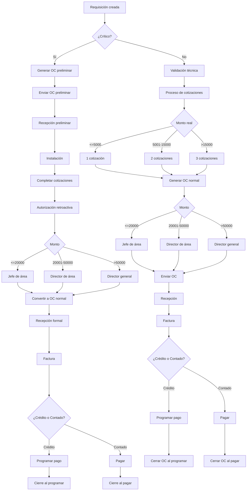

# Flujo Compras COMAQSA – Documentación Completa V5

## 📌 Explicación General – Cómo Funciona el Módulo de Compras del ERP COMAQSA
El módulo controla tres áreas críticas:
1. Control técnico
2. Control comercial
3. Control financiero

## 📌 Reglas de Cotizaciones (Actualizadas)
- 1 cotización → Hasta $5,000
- 2 cotizaciones → $5,001 a $15,000
- 3 cotizaciones + comparativo → Más de $15,000

## 📌 Explicación V1 – Variaciones del Flujo por Tipo de Orden

### 1. Orden Normal + Crédito
1. Requisición  
2. Validación técnica  
3. Cotizaciones  
4. Autorización  
5. OC normal  
6. Envío  
7. Recepción formal  
8. Factura  
9. Programar pago  
10. **Cierre al programar pago**

### 2. Orden Normal + Contado
1. Requisición  
2. Validación técnica  
3. Cotizaciones  
4. Autorización  
5. OC normal  
6. **No se envía sin pagar**  
7. Pago  
8. Envío  
9. Recepción  
10. Factura  
11. **Cierre al pagar**

### 3. Orden Crítica + Crédito
1. Requisición crítica  
2. OC preliminar  
3. Separación inmediata  
4. Recepción preliminar  
5. Instalación  
6. Cotizaciones  
7. Autorización retroactiva  
8. OC normal  
9. Recepción  
10. Factura  
11. Programar pago  
12. **Cierre al programar**

### 4. Orden Crítica + Contado
1. Requisición crítica  
2. OC preliminar  
3. Proveedor requiere pago  
4. Pago anticipado  
5. Envío  
6. Recepción  
7. Confirmar precio  
8. Autorización retroactiva  
9. Factura  
10. **Cierre al pagar**

## 📌 BPMN – Flujo Maestro

